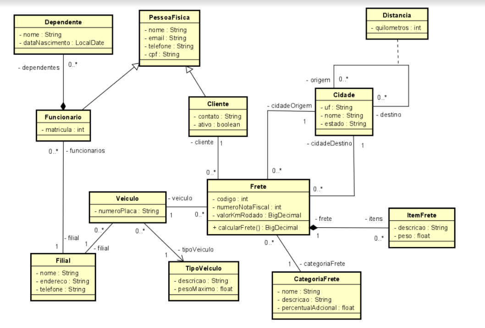

# Laboratório V
### 09/08/2024

## Sobre

### Contexto
Nosso estudo de caso é um sistema de frete para uma transportadora. Para isto, vamos
supor que fazemos parte da fábrica de software DCOMP-Softhouse e recebemos a
seguinte solicitação: desenvolvimento da camada de domínio com os mapeamentos das
entidades para o backend de um sistema de controle de fretes. Além da implementação
inicial de um serviço de cadastro de fretes.

Cidades contêm o nome da cidade e o estado a que pertence, representando as
cidades abrangidas pela empresa de transporte. Distâncias envolvem as cidades de
origem e de destino e, para cada par de cidades atendidas, deve haver a distância em
quilômetros entre elas. Categoria do frete deve conter descrição e um percentual, que
deve incidir sobre o valor do frete onde,por exemplo, entregas rápidas têm aumento
de 10%, entregas super-rápidas têm aumento de 30%, e entrega normal não tem
acréscimo no valor. Cada Frete tem um código, um cliente, o veículo que deve efetuar
o frete, cidade origem e cidade destino, funcionário responsável e itens a serem
transportados, não podendo haver um frete sem os dados citados. Cada frete deve ter
ainda o seu valor, que deve ser calculado através da distância entre as cidades
envolvidas e da categoria do frete. Para isso, deve existir um valor padrão para o km
rodado. Um Item de Transporte é cada objeto a ser transportado num frete deve
possuir apenas uma descrição e seu peso.

### Desenvolvimento

O projeto foi dividido em camadas `Model`, `Repository` e `Service`, partindo do diagrama UML proposto. Neste projeto `Maven`, utilizamos:

- `Jakarta JPA`
- `Hibernate`
- `Lombok`
- `MySQL`

## Modelo

## Funcionalidades

- **`Exemplo`**: descrição.  

# Desenvolvido por

* [José Júnior](https://github.com/jjuniorbrasil)
* [Pedro Julius](https://github.com/Pedro-SousaM)
* [Rudney Gabriel](https://github.com/rudneyggf)
